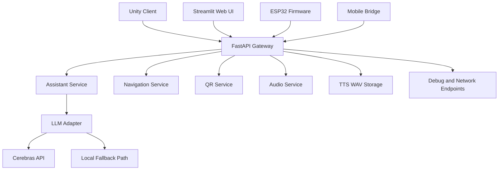
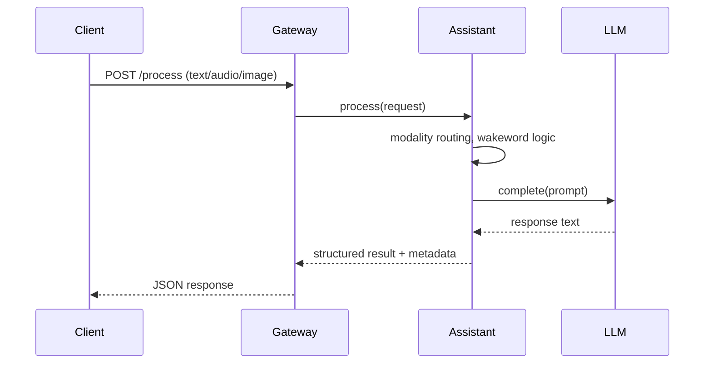
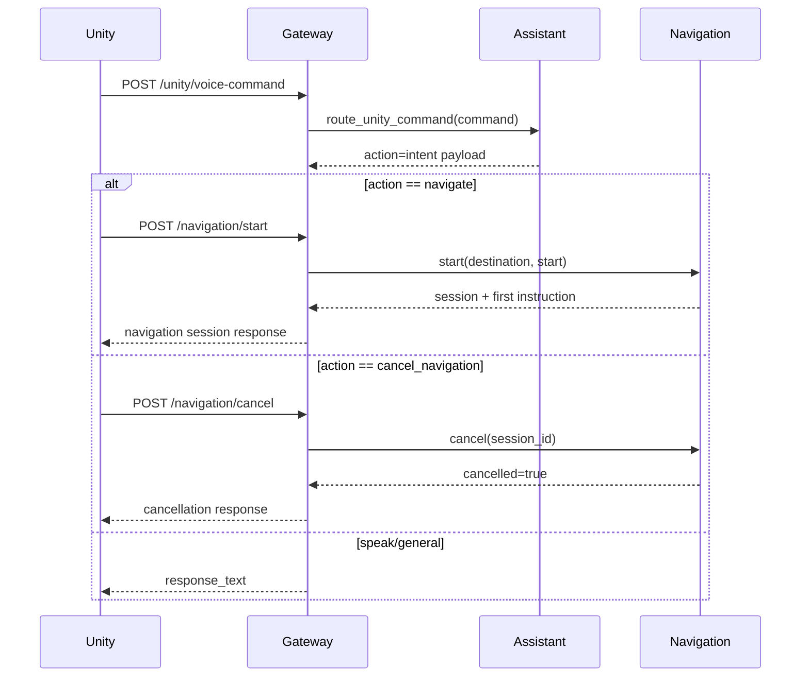
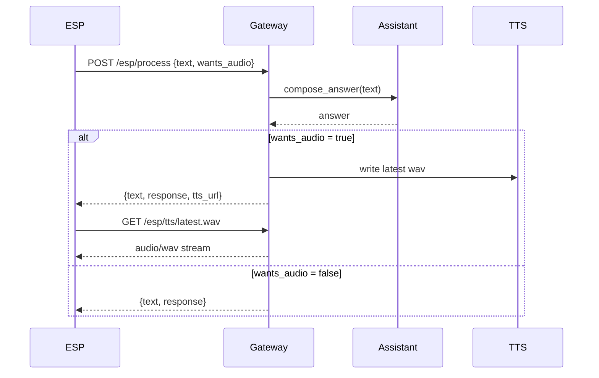
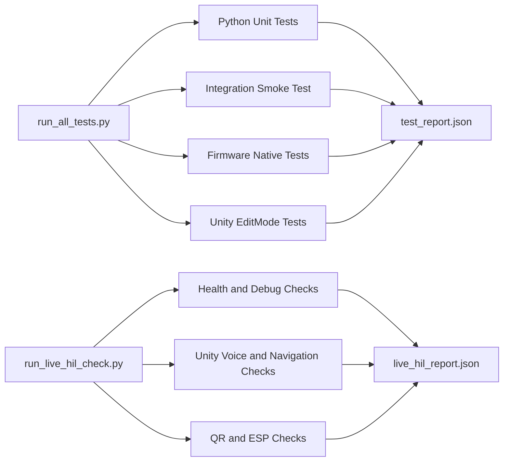
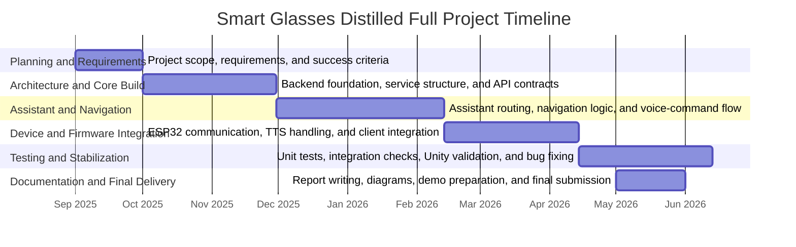

# Architecture and Dataflow Diagrams

This file contains Mermaid diagrams that can be reused in your report and presentation slides.

## 1) High-Level Component Architecture

## 2) `/process` Request Sequence

## 3) Unity Voice Command to Navigation Flow

## 4) ESP Process and TTS Fetch Contract

## 5) Test and Validation Pipeline

## 6) Roadmap Timeline (Graduation to Product)

## How To Use These Diagrams

1. Use diagrams 1 and 2 in the architecture chapter.
2. Use diagrams 3 and 4 in implementation and demo-flow slides.
3. Use diagram 5 in the evaluation chapter.
4. Use diagram 6 in future work and roadmap slides.
