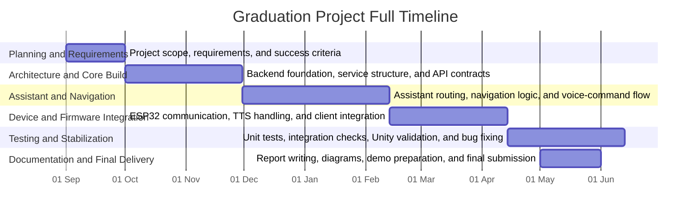

# Future Roadmap and Research Plan

This roadmap translates current project capabilities into a structured continuation plan suitable for post-graduation development.

## 1. Strategic Direction

### 1.1 Vision

Evolve Smart Glasses Distilled from a validated prototype into a robust assistive platform for indoor navigation and contextual voice interaction.

### 1.2 Guiding Principles

1. Keep API contracts stable across client upgrades.
2. Increase reliability before adding major feature scope.
3. Prioritize measurable improvements with explicit KPIs.
4. Separate research experiments from production-critical flows.

## 2. 0-3 Month Plan (Stabilization)

### 2.1 Reliability and Quality

1. Replace in-memory navigation sessions with persistent storage.
2. Add structured request IDs and trace logging.
3. Add startup readiness checks for model/provider dependencies.
4. Harden error handling and user-facing fallbacks.

### 2.2 Security Baseline

1. Rotate and externalize all secrets.
2. Enforce auth and rate limiting for sensitive endpoints.
3. Restrict CORS in non-local profiles.

### 2.3 Testing Expansion

1. Add regression tests for ESP compatibility (`text`/`response` behavior).
2. Add CI profile that runs Python + integration tests on each PR.
3. Keep Unity and firmware tests runnable in scheduled pipelines where environment supports them.

KPI targets:

1. > = 90% pass consistency for automated daily runs.
2. <= 1% live-check endpoint failure rate in controlled LAN tests.

## 3. 3-6 Month Plan (Capability Growth)

### 3.1 Navigation Intelligence

1. Replace synthetic step generation with graph-based route planning using building metadata.
2. Add rerouting triggers from QR/position updates.
3. Build destination ambiguity handling with clarification prompts.

### 3.2 Voice and Interaction Quality

1. Improve wakeword false-positive suppression with confidence gating.
2. Add user profile adaptation for language and phrasing patterns.
3. Add contextual memory summaries per session.

### 3.3 Firmware and Device Loop

1. Move from placeholder TTS fetch/play flow to robust on-device playback path.
2. Add network resilience strategy (retry, backoff, offline cache for recent prompts).
3. Benchmark BLE relay vs direct WiFi mode under controlled latency tests.

KPI targets:

1. Median end-to-end command roundtrip < 2.0s on LAN.
2. Navigation route success >= 95% on predefined campus scenarios.

## 4. 6-12 Month Plan (Productization)

### 4.1 Architecture Hardening

1. Split gateway into bounded services if load justifies decomposition.
2. Introduce event bus for telemetry and asynchronous integrations.
3. Add dashboard for runtime health, intent distribution, and error trends.

### 4.2 Multi-Client Product Readiness

1. Align Unity, mobile, and firmware endpoint contracts under versioned API policy.
2. Add release channels (dev, demo, stable).
3. Add migration playbooks for client updates.

### 4.3 Deployment and Operations

1. Containerized deployment profile.
2. Automated rollout and rollback procedures.
3. Incident runbook and postmortem templates.

KPI targets:

1. > = 99% gateway uptime in hosted demo environment.
2. Mean time to detect failures < 5 minutes with alerting.

## 5. Research Extensions (Thesis and Publication Friendly)

### 5.1 Technical Research Ideas

1. Hybrid symbolic + LLM navigation reasoning for better explainability.
2. Personalization model for user-specific command interpretation.
3. Sensor fusion for indoor localization confidence scoring.
4. Hallucination-aware response verification in assistive contexts.

### 5.2 Experimental Tracks

1. Compare cloud-first vs edge-first inference quality/latency tradeoffs.
2. Evaluate multimodal prompt strategies (text-only, text+image, audio-only).
3. Measure usability outcomes with and without adaptive guidance.

### 5.3 Potential Academic Contributions

1. A reusable architecture pattern for wearable multimodal assistants.
2. Contract-compatibility migration method for embedded clients.
3. Practical benchmark methodology combining unit, integration, and live HIL checks.

## 6. Future Feature Ideas

1. Multi-building campus graph with elevator/stairs accessibility preferences.
2. Instructor/lecture awareness from schedule data.
3. Emergency guidance mode with nearest safe-exit routing.
4. Context-triggered briefings when entering known QR zones.
5. Team collaboration mode for shared navigation sessions.

## 7. Risk Register for Future Work

1. Dependency risk: cloud model/API availability.
2. Device fragmentation risk across wearables and phone OS versions.
3. Data governance risk for telemetry and audio artifacts.
4. Scope creep risk in academic timelines.

Mitigations:

1. Fallback runtime paths and progressive degradation modes.
2. Versioned API contracts and compatibility tests.
3. Clear data retention and anonymization rules.
4. Milestone-based scope freeze checkpoints.

## 8. Execution Framework

### 8.1 Governance Cadence

1. Weekly engineering review (defects, performance, roadmap).
2. Bi-weekly architecture review (tradeoffs, debt decisions).
3. Monthly milestone review (KPI trend and demo readiness).

### 8.2 Definition of Done (for Major Features)

1. API contract documented and tested.
2. Automated test coverage added.
3. Live HIL scenario updated if behavior crosses device boundaries.
4. Operational and rollback notes documented.

## 9. Time Plan for Documentation

This time plan is written as a full graduation-project schedule from September 1 to June 1 and can be inserted directly into the report or defense materials.

Milestone summary:

1. End of September: Scope, requirements, and deliverables confirmed.
2. End of November: Core backend architecture and API structure completed.
3. End of February: Assistant, navigation, and client flows integrated.
4. End of April: Device communication, testing, and stabilization completed.
5. End of June: Documentation, presentation, and final submission completed.

## 10. Work Split for Three Students

This split is organized so each student owns a clear part of the system while still contributing to the final integration and presentation.

| Student   | Main Responsibility                                                                          | What to Present                                                      |
| --------- | -------------------------------------------------------------------------------------------- | -------------------------------------------------------------------- |
| Student 1 | Backend, FastAPI gateway, assistant service, LLM integration, and API contracts              | Show the system architecture, request flow, and AI response pipeline |
| Student 2 | Navigation logic, Unity or mobile client flow, QR handling, and user interaction design      | Show the navigation demo, command flow, and client-side experience   |
| Student 3 | ESP32 or device integration, audio/TTS handling, testing, validation, and deployment support | Show hardware communication, test results, and system reliability    |

Shared final tasks:

1. Integrate all modules into one working demo.
2. Review and finalize the report, diagrams, and slides.
3. Rehearse the presentation together so each student can explain their part clearly.

## 11. Closing Note

The project is already at a strong prototype maturity stage. The roadmap above converts that momentum into a clear progression from academic demonstration to engineering-grade product quality.
