# CEREBRO Graduation Diagrams — UML, Architecture & Database

Complete Mermaid diagram set for the graduation thesis / docx.  
Based on the **implemented** Smart Glasses Distilled (CEREBRO) codebase.

> **Export to Word:** Paste each block into [mermaid.live](https://mermaid.live), export as **PNG** or **SVG**, then insert into your docx.  
> Existing sequence/roadmap diagrams are in [architecture_and_dataflow_diagrams.md](architecture_and_dataflow_diagrams.md).

---

## Table of Contents

1. [UML — Use Case Diagrams](#1-uml--use-case-diagrams)
2. [UML — Class Diagrams](#2-uml--class-diagrams)
3. [UML — Component Diagram](#3-uml--component-diagram)
4. [UML — Sequence Diagrams](#4-uml--sequence-diagrams)
5. [UML — Activity & State Diagrams](#5-uml--activity--state-diagrams)
6. [System Architecture Diagrams](#6-system-architecture-diagrams)
7. [Deployment & Process Topology](#7-deployment--process-topology)
8. [Database — ER & Schema Diagrams](#8-database--er--schema-diagrams)

---

## 1. UML — Use Case Diagrams

### 1.1 Core System Use Cases

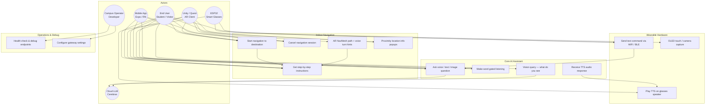
```mermaid
flowchart TB
    subgraph Actors
        EU((End User<br/>Student / Visitor))
        OP((Campus Operator<br/>Developer))
        HW((ESP32<br/>Smart Glasses))
        MO((Mobile App<br/>Expo / RN))
        AR((Unity / Quest<br/>AR Client))
        CL((Cloud LLM<br/>Cerebras))
    end

    subgraph CoreAssistant["Core AI Assistant"]
        UC1[Ask voice / text / image question]
        UC2[Wake-word gated listening]
        UC3[Vision query — what do you see]
        UC4[Receive TTS audio response]
    end

    subgraph Navigation["Indoor Navigation"]
        UC5[Start navigation to destination]
        UC6[Get step-by-step instructions]
        UC7[Cancel navigation session]
        UC8[AR NavMesh path + voice turn hints]
        UC9[Proximity location info popups]
    end

    subgraph Hardware["Wearable Hardware"]
        UC10[Send text command via WiFi / BLE]
        UC11[Play TTS on glasses speaker]
        UC12[OLED touch / camera capture]
    end

    subgraph Ops["Operations & Debug"]
        UC18[Health check & debug endpoints]
        UC19[Configure gateway settings]
    end

    EU --> UC1 & UC2 & UC3 & UC5 & UC6 & UC7 & UC9
    MO --> UC1 & UC2 & UC5 & UC6 & UC7
    AR --> UC1 & UC5 & UC6 & UC7 & UC8 & UC9
    HW --> UC10 & UC11 & UC12
    EU --> UC10

    UC1 --> CL
    UC3 --> CL
    UC4 --> UC11
    UC10 --> UC1
    UC5 --> UC6
    UC8 --> UC6

    OP --> UC18 & UC19
```

### 1.2 Extended Use Cases (QR, Bus, Floorplan)

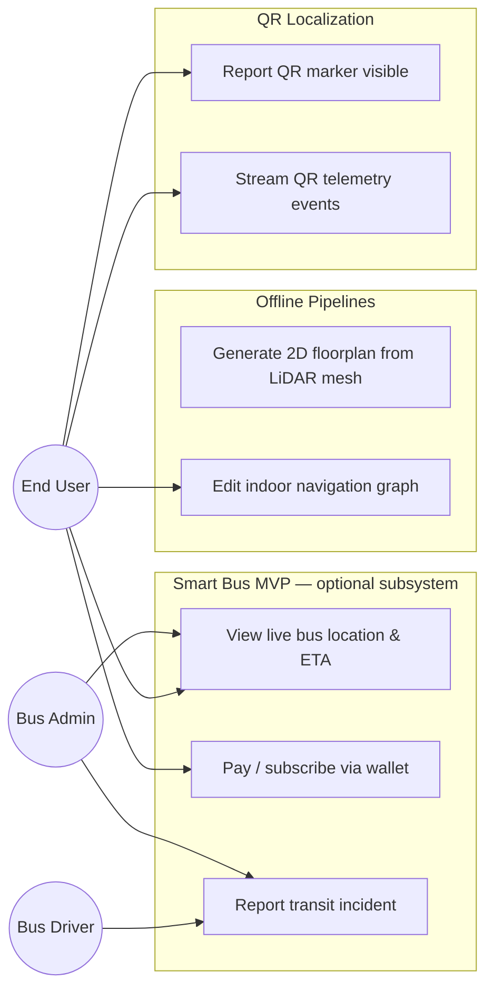
```mermaid
flowchart LR
    EU((End User))
    DRV((Bus Driver))
    ADM((Bus Admin))

    subgraph QR["QR Localization"]
        UC13[Report QR marker visible]
        UC14[Stream QR telemetry events]
    end

    subgraph Bus["Smart Bus MVP — optional subsystem"]
        UC15[View live bus location & ETA]
        UC16[Pay / subscribe via wallet]
        UC17[Report transit incident]
    end

    subgraph Offline["Offline Pipelines"]
        UC20[Generate 2D floorplan from LiDAR mesh]
        UC21[Edit indoor navigation graph]
    end

    EU --> UC13 & UC14 & UC15 & UC16 & UC21
    DRV --> UC17
    ADM --> UC17 & UC15
```

---

## 2. UML — Class Diagrams

### 2.1 Backend Domain Services & DTOs

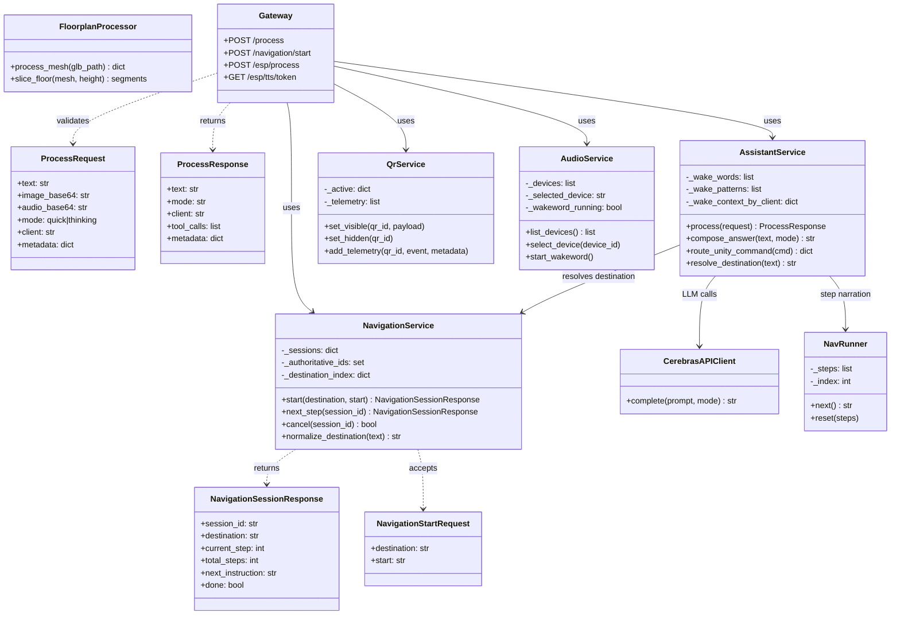
```mermaid
classDiagram
    direction TB

    class ProcessRequest {
        +text: str
        +image_base64: str
        +audio_base64: str
        +mode: quick|thinking
        +client: str
        +metadata: dict
    }

    class ProcessResponse {
        +text: str
        +mode: str
        +client: str
        +tool_calls: list
        +metadata: dict
    }

    class NavigationStartRequest {
        +destination: str
        +start: str
    }

    class NavigationSessionResponse {
        +session_id: str
        +destination: str
        +current_step: int
        +total_steps: int
        +next_instruction: str
        +done: bool
    }

    class AssistantService {
        -_wake_words: list
        -_wake_patterns: list
        -_wake_context_by_client: dict
        +process(request) ProcessResponse
        +compose_answer(text, mode) str
        +route_unity_command(cmd) dict
        +resolve_destination(text) str
    }

    class NavigationService {
        -_sessions: dict
        -_authoritative_ids: set
        -_destination_index: dict
        +start(destination, start) NavigationSessionResponse
        +next_step(session_id) NavigationSessionResponse
        +cancel(session_id) bool
        +normalize_destination(text) str
    }

    class QrService {
        -_active: dict
        -_telemetry: list
        +set_visible(qr_id, payload)
        +set_hidden(qr_id)
        +add_telemetry(qr_id, event, metadata)
    }

    class AudioService {
        -_devices: list
        -_selected_device: str
        -_wakeword_running: bool
        +list_devices() list
        +select_device(device_id)
        +start_wakeword()
    }

    class FloorplanProcessor {
        +process_mesh(glb_path) dict
        +slice_floor(mesh, height) segments
    }

    class CerebrasAPIClient {
        +complete(prompt, mode) str
    }

    class NavRunner {
        -_steps: list
        -_index: int
        +next() str
        +reset(steps)
    }

    class Gateway {
        +POST /process
        +POST /navigation/start
        +POST /esp/process
        +GET /esp/tts/token
    }

    Gateway --> AssistantService : uses
    Gateway --> NavigationService : uses
    Gateway --> QrService : uses
    Gateway --> AudioService : uses
    Gateway ..> ProcessRequest : validates
    Gateway ..> ProcessResponse : returns
    AssistantService --> NavigationService : resolves destination
    AssistantService --> CerebrasAPIClient : LLM calls
    AssistantService --> NavRunner : step narration
    NavigationService ..> NavigationSessionResponse : returns
    NavigationService ..> NavigationStartRequest : accepts
```

### 2.2 Unity AR Client Classes

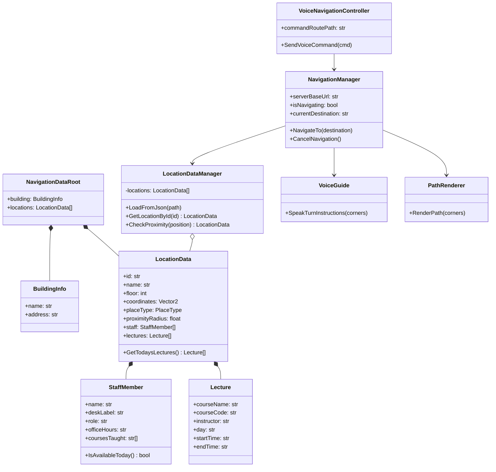
```mermaid
classDiagram
    direction TB

    class NavigationDataRoot {
        +building: BuildingInfo
        +locations: LocationData[]
    }

    class BuildingInfo {
        +name: str
        +address: str
    }

    class LocationData {
        +id: str
        +name: str
        +floor: int
        +coordinates: Vector2
        +placeType: PlaceType
        +proximityRadius: float
        +staff: StaffMember[]
        +lectures: Lecture[]
        +GetTodaysLectures() Lecture[]
    }

    class StaffMember {
        +name: str
        +deskLabel: str
        +role: str
        +officeHours: str
        +coursesTaught: str[]
        +IsAvailableToday() bool
    }

    class Lecture {
        +courseName: str
        +courseCode: str
        +instructor: str
        +day: str
        +startTime: str
        +endTime: str
    }

    class LocationDataManager {
        -locations: LocationData[]
        +LoadFromJson(path)
        +GetLocationById(id) LocationData
        +CheckProximity(position) LocationData
    }

    class NavigationManager {
        +serverBaseUrl: str
        +isNavigating: bool
        +currentDestination: str
        +NavigateTo(destination)
        +CancelNavigation()
    }

    class VoiceNavigationController {
        +commandRoutePath: str
        +SendVoiceCommand(cmd)
    }

    class VoiceGuide {
        +SpeakTurnInstructions(corners)
    }

    class PathRenderer {
        +RenderPath(corners)
    }

    NavigationDataRoot *-- BuildingInfo
    NavigationDataRoot *-- LocationData
    LocationData *-- StaffMember
    LocationData *-- Lecture
    LocationDataManager o-- LocationData
    NavigationManager --> VoiceGuide
    NavigationManager --> PathRenderer
    NavigationManager --> LocationDataManager
    VoiceNavigationController --> NavigationManager
```

### 2.3 Mobile Client API Layer

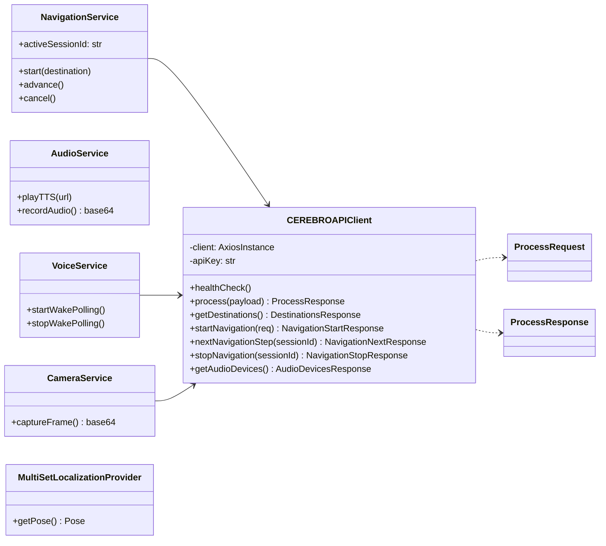
```mermaid
classDiagram
    direction LR

    class CEREBROAPIClient {
        -client: AxiosInstance
        -apiKey: str
        +healthCheck()
        +process(payload) ProcessResponse
        +getDestinations() DestinationsResponse
        +startNavigation(req) NavigationStartResponse
        +nextNavigationStep(sessionId) NavigationNextResponse
        +stopNavigation(sessionId) NavigationStopResponse
        +getAudioDevices() AudioDevicesResponse
    }

    class CameraService {
        +captureFrame() base64
    }

    class AudioService {
        +playTTS(url)
        +recordAudio() base64
    }

    class VoiceService {
        +startWakePolling()
        +stopWakePolling()
    }

    class NavigationService {
        +activeSessionId: str
        +start(destination)
        +advance()
        +cancel()
    }

    class MultiSetLocalizationProvider {
        +getPose() Pose
    }

    CEREBROAPIClient ..> ProcessRequest
    CEREBROAPIClient ..> ProcessResponse
    NavigationService --> CEREBROAPIClient
    VoiceService --> CEREBROAPIClient
    CameraService --> CEREBROAPIClient
```

### 2.4 Bus MVP ORM Classes

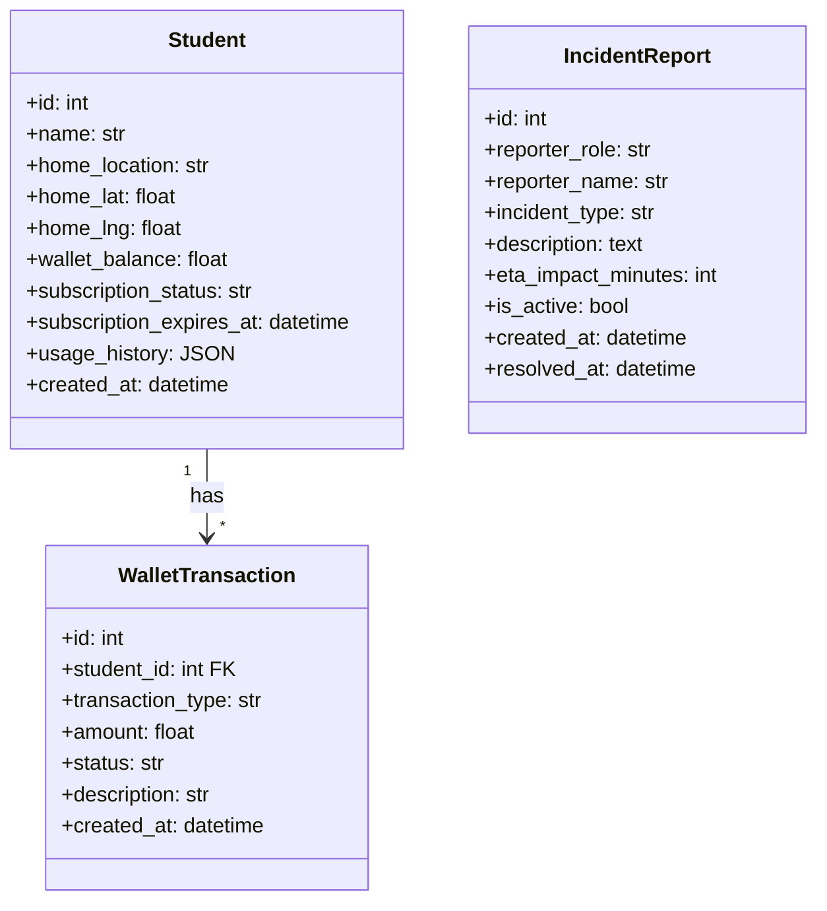
```mermaid
classDiagram
    direction TB

    class Student {
        +id: int
        +name: str
        +home_location: str
        +home_lat: float
        +home_lng: float
        +wallet_balance: float
        +subscription_status: str
        +subscription_expires_at: datetime
        +usage_history: JSON
        +created_at: datetime
    }

    class WalletTransaction {
        +id: int
        +student_id: int FK
        +transaction_type: str
        +amount: float
        +status: str
        +description: str
        +created_at: datetime
    }

    class IncidentReport {
        +id: int
        +reporter_role: str
        +reporter_name: str
        +incident_type: str
        +description: text
        +eta_impact_minutes: int
        +is_active: bool
        +created_at: datetime
        +resolved_at: datetime
    }

    Student "1" --> "*" WalletTransaction : has
```

---

## 3. UML — Component Diagram

### 3.1 System Component Diagram

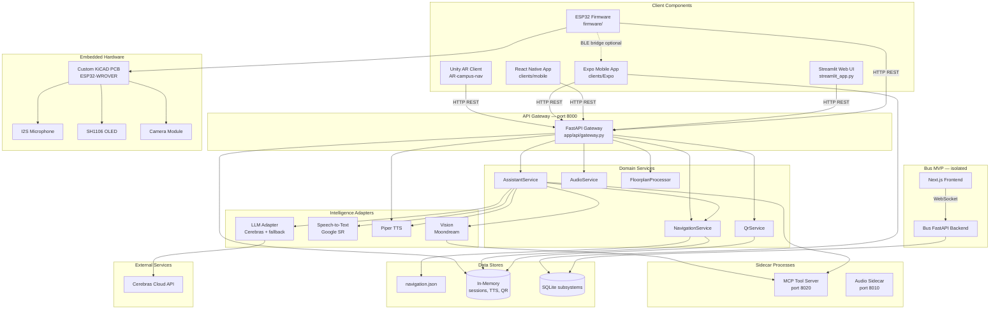
```mermaid
flowchart TB
    subgraph Clients["Client Components"]
        U[Unity AR Client<br/>AR-campus-nav]
        E[Expo Mobile App<br/>clients/Expo]
        M[React Native App<br/>clients/mobile]
        S[Streamlit Web UI<br/>streamlit_app.py]
        ESP[ESP32 Firmware<br/>firmware/]
    end

    subgraph Gateway["API Gateway — port 8000"]
        G[FastAPI Gateway<br/>app/api/gateway.py]
    end

    subgraph Services["Domain Services"]
        AS[AssistantService]
        NS[NavigationService]
        QS[QrService]
        AUS[AudioService]
        FP[FloorplanProcessor]
    end

    subgraph Intelligence["Intelligence Adapters"]
        LLM[LLM Adapter<br/>Cerebras + fallback]
        STT[Speech-to-Text<br/>Google SR]
        TTS[Piper TTS]
        VIS[Vision<br/>Moondream]
    end

    subgraph Sidecars["Sidecar Processes"]
        MCP[MCP Tool Server<br/>port 8020]
        AUD[Audio Sidecar<br/>port 8010]
    end

    subgraph Data["Data Stores"]
        NJ[navigation.json]
        MEM[(In-Memory<br/>sessions, TTS, QR)]
        SQLITE[(SQLite subsystems)]
    end

    subgraph External["External Services"]
        CB[Cerebras Cloud API]
    end

    subgraph Hardware["Embedded Hardware"]
        PCB[Custom KiCAD PCB<br/>ESP32-WROVER]
        MIC[I2S Microphone]
        OLED[SH1106 OLED]
        CAM[Camera Module]
    end

    U & E & M & S & ESP -->|HTTP REST| G
    ESP -.->|BLE bridge optional| E

    G --> AS & NS & QS & AUS & FP
    AS --> LLM & STT & VIS & TTS
    AS --> NS
    NS --> NJ
    LLM --> CB
    VIS --> MCP
    AS --> MCP
    G --> TTS
    G --> MEM
    NS --> MEM
    QS --> MEM

    E --> SQLITE
    subgraph BusMVP["Bus MVP — isolated"]
        BB[Bus FastAPI Backend]
        BF[Next.js Frontend]
        BB --> SQLITE
        BF -->|WebSocket| BB
    end

    ESP --> PCB
    PCB --> MIC & OLED & CAM
```

### 3.2 Package / Module Dependency Diagram

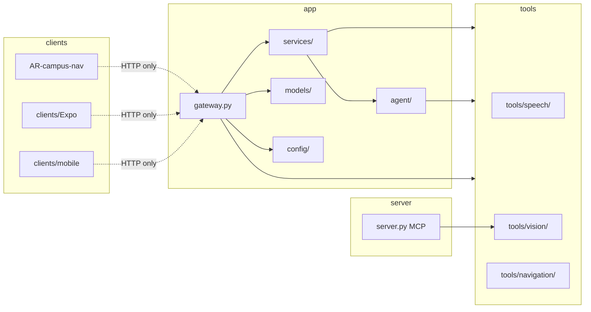
```mermaid
flowchart LR
    subgraph app
        api[gateway.py]
        svc[services/]
        mdl[models/]
        agt[agent/]
        cfg[config/]
    end

    subgraph tools
        sp[tools/speech/]
        vs[tools/vision/]
        nv[tools/navigation/]
    end

    subgraph server
        mcp[server.py MCP]
    end

    subgraph clients
        unity[AR-campus-nav]
        expo[clients/Expo]
        mobile[clients/mobile]
    end

    api --> svc & mdl & cfg
    svc --> agt & tools
    agt --> tools
    api --> tools
    mcp --> vs

    unity & expo & mobile -.->|HTTP only| api
```

---

## 4. UML — Sequence Diagrams

### 4.1 Multimodal `/process` — Voice Q&A

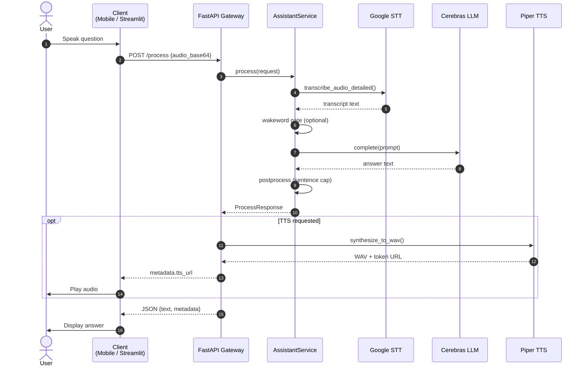
```mermaid
sequenceDiagram
    autonumber
    actor User
    participant Client as Client<br/>(Mobile / Streamlit)
    participant GW as FastAPI Gateway
    participant AS as AssistantService
    participant STT as Google STT
    participant LLM as Cerebras LLM
    participant TTS as Piper TTS

    User->>Client: Speak question
    Client->>GW: POST /process {audio_base64}
    GW->>AS: process(request)
    AS->>STT: transcribe_audio_detailed()
    STT-->>AS: transcript text
    AS->>AS: wakeword gate (optional)
    AS->>LLM: complete(prompt)
    LLM-->>AS: answer text
    AS->>AS: postprocess (sentence cap)
    AS-->>GW: ProcessResponse
    opt TTS requested
        GW->>TTS: synthesize_to_wav()
        TTS-->>GW: WAV + token URL
        GW-->>Client: metadata.tts_url
        Client->>User: Play audio
    end
    GW-->>Client: JSON {text, metadata}
    Client->>User: Display answer
```

### 4.2 Unity Voice → Navigation

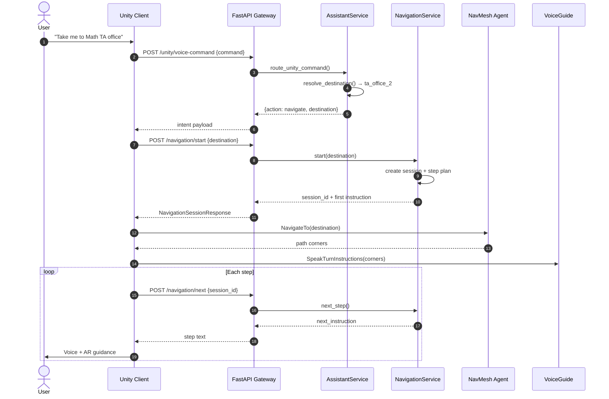
```mermaid
sequenceDiagram
    autonumber
    actor User
    participant Unity as Unity Client
    participant GW as FastAPI Gateway
    participant AS as AssistantService
    participant NS as NavigationService
    participant NM as NavMesh Agent
    participant VG as VoiceGuide

    User->>Unity: "Take me to Math TA office"
    Unity->>GW: POST /unity/voice-command {command}
    GW->>AS: route_unity_command()
    AS->>AS: resolve_destination() → ta_office_2
    AS-->>GW: {action: navigate, destination}
    GW-->>Unity: intent payload

    Unity->>GW: POST /navigation/start {destination}
    GW->>NS: start(destination)
    NS->>NS: create session + step plan
    NS-->>GW: session_id + first instruction
    GW-->>Unity: NavigationSessionResponse

    Unity->>NM: NavigateTo(destination)
    NM-->>Unity: path corners
    Unity->>VG: SpeakTurnInstructions(corners)

    loop Each step
        Unity->>GW: POST /navigation/next {session_id}
        GW->>NS: next_step()
        NS-->>GW: next_instruction
        GW-->>Unity: step text
        Unity->>User: Voice + AR guidance
    end
```

### 4.3 ESP32 Text Command + TTS Playback

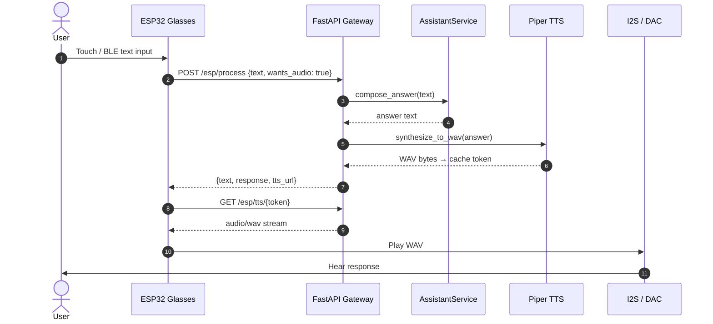
```mermaid
sequenceDiagram
    autonumber
    actor User
    participant ESP as ESP32 Glasses
    participant GW as FastAPI Gateway
    participant AS as AssistantService
    participant TTS as Piper TTS
    participant DAC as I2S / DAC

    User->>ESP: Touch / BLE text input
    ESP->>GW: POST /esp/process {text, wants_audio: true}
    GW->>AS: compose_answer(text)
    AS-->>GW: answer text
    GW->>TTS: synthesize_to_wav(answer)
    TTS-->>GW: WAV bytes → cache token
    GW-->>ESP: {text, response, tts_url}

    ESP->>GW: GET /esp/tts/{token}
    GW-->>ESP: audio/wav stream
    ESP->>DAC: Play WAV
    DAC->>User: Hear response
```

### 4.4 Vision Query Flow

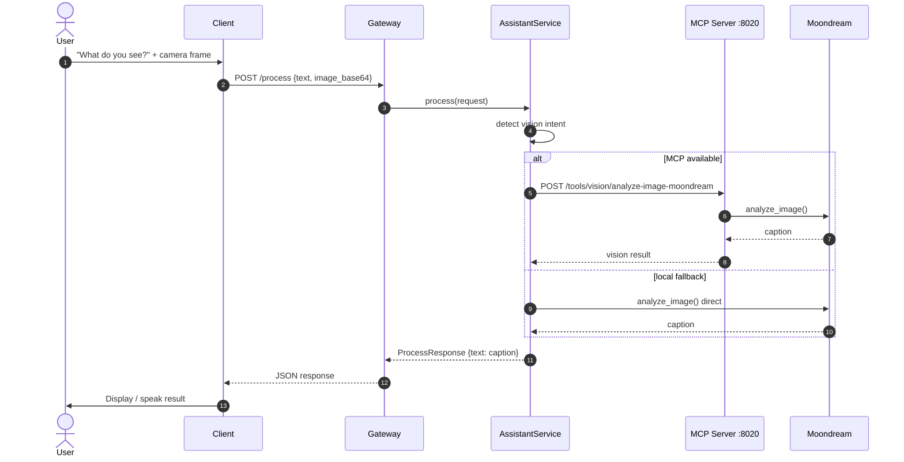
```mermaid
sequenceDiagram
    autonumber
    actor User
    participant Client
    participant GW as Gateway
    participant AS as AssistantService
    participant MCP as MCP Server :8020
    participant MD as Moondream

    User->>Client: "What do you see?" + camera frame
    Client->>GW: POST /process {text, image_base64}
    GW->>AS: process(request)
    AS->>AS: detect vision intent
    alt MCP available
        AS->>MCP: POST /tools/vision/analyze-image-moondream
        MCP->>MD: analyze_image()
        MD-->>MCP: caption
        MCP-->>AS: vision result
    else local fallback
        AS->>MD: analyze_image() direct
        MD-->>AS: caption
    end
    AS-->>GW: ProcessResponse {text: caption}
    GW-->>Client: JSON response
    Client->>User: Display / speak result
```

---

## 5. UML — Activity & State Diagrams

### 5.1 Assistant Processing Activity

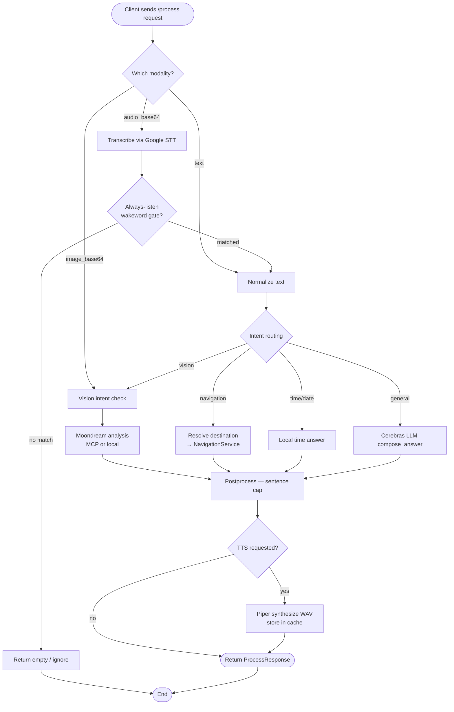
```mermaid
flowchart TD
    START([Client sends /process request]) --> CHECK_MOD{Which modality?}

    CHECK_MOD -->|audio_base64| STT[Transcribe via Google STT]
    CHECK_MOD -->|text| NORM[Normalize text]
    CHECK_MOD -->|image_base64| VISION[Vision intent check]

    STT --> WAKE{Always-listen<br/>wakeword gate?}
    WAKE -->|no match| REJECT[Return empty / ignore]
    WAKE -->|matched| NORM

    NORM --> ROUTE{Intent routing}
    ROUTE -->|navigation| NAV[Resolve destination<br/>→ NavigationService]
    ROUTE -->|vision| VISION
    ROUTE -->|time/date| LOCAL[Local time answer]
    ROUTE -->|general| LLM[Cerebras LLM compose_answer]

    VISION --> MOON[Moondream analysis<br/>MCP or local]
    MOON --> POST
    NAV --> POST
    LOCAL --> POST
    LLM --> POST[Postprocess — sentence cap]

    POST --> TTS_OPT{TTS requested?}
    TTS_OPT -->|yes| SYNTH[Piper synthesize WAV<br/>store in cache]
    TTS_OPT -->|no| RESP
    SYNTH --> RESP([Return ProcessResponse])

    REJECT --> END([End])
    RESP --> END
```

### 5.2 Navigation Session State Machine

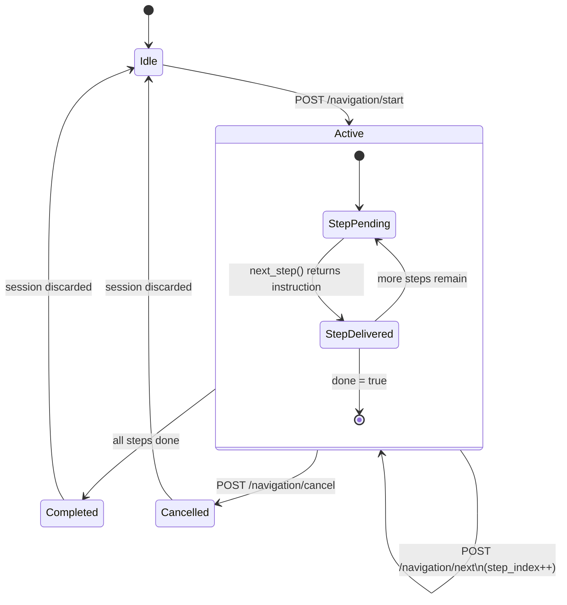
```mermaid
stateDiagram-v2
    [*] --> Idle

    Idle --> Active : POST /navigation/start
    Active --> Active : POST /navigation/next\n(step_index++)
    Active --> Completed : all steps done
    Active --> Cancelled : POST /navigation/cancel
    Completed --> Idle : session discarded
    Cancelled --> Idle : session discarded

    state Active {
        [*] --> StepPending
        StepPending --> StepDelivered : next_step() returns instruction
        StepDelivered --> StepPending : more steps remain
        StepDelivered --> [*] : done = true
    }
```

### 5.3 ESP32 Runtime Mode Activity

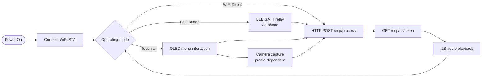
```mermaid
flowchart LR
    BOOT([Power On]) --> WIFI[Connect WiFi STA]
    WIFI --> MODE{Operating mode}

    MODE -->|WiFi Direct| HTTP[HTTP POST /esp/process]
    MODE -->|BLE Bridge| BLE[BLE GATT relay<br/>via phone]
    MODE -->|Touch UI| OLED[OLED menu interaction]

    HTTP --> FETCH[GET /esp/tts/token]
    BLE --> HTTP
    OLED --> HTTP

    FETCH --> PLAY[I2S audio playback]
    PLAY --> MODE

    OLED --> CAM[Camera capture<br/>profile-dependent]
    CAM --> HTTP
```

---

## 6. System Architecture Diagrams

### 6.1 Layered Architecture

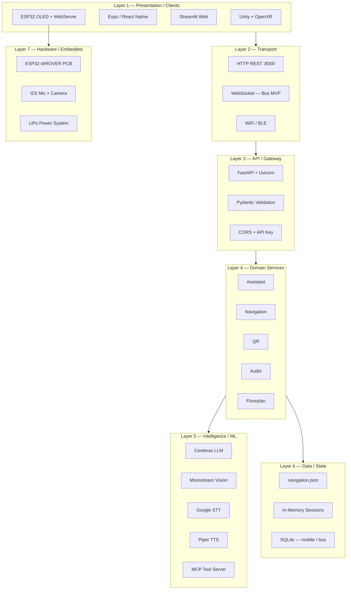
```mermaid
flowchart TB
    subgraph L1["Layer 1 — Presentation / Clients"]
        direction LR
        L1A[Unity + OpenXR]
        L1B[Expo / React Native]
        L1C[Streamlit Web]
        L1D[ESP32 OLED + WebServer]
    end

    subgraph L2["Layer 2 — Transport"]
        direction LR
        L2A[HTTP REST :8000]
        L2B[WebSocket — Bus MVP]
        L2C[WiFi / BLE]
    end

    subgraph L3["Layer 3 — API / Gateway"]
        L3A[FastAPI + Uvicorn]
        L3B[Pydantic Validation]
        L3C[CORS + API Key]
    end

    subgraph L4["Layer 4 — Domain Services"]
        direction LR
        L4A[Assistant]
        L4B[Navigation]
        L4C[QR]
        L4D[Audio]
        L4E[Floorplan]
    end

    subgraph L5["Layer 5 — Intelligence / ML"]
        direction LR
        L5A[Cerebras LLM]
        L5B[Moondream Vision]
        L5C[Google STT]
        L5D[Piper TTS]
        L5E[MCP Tool Server]
    end

    subgraph L6["Layer 6 — Data / State"]
        direction LR
        L6A[navigation.json]
        L6B[In-Memory Sessions]
        L6C[SQLite — mobile / bus]
    end

    subgraph L7["Layer 7 — Hardware / Embedded"]
        direction LR
        L7A[ESP32-WROVER PCB]
        L7B[I2S Mic + Camera]
        L7C[LiPo Power System]
    end

    L1 --> L2 --> L3 --> L4 --> L5
    L4 --> L6
    L1D --> L7
```

### 6.2 C4 Context Diagram (System Context)

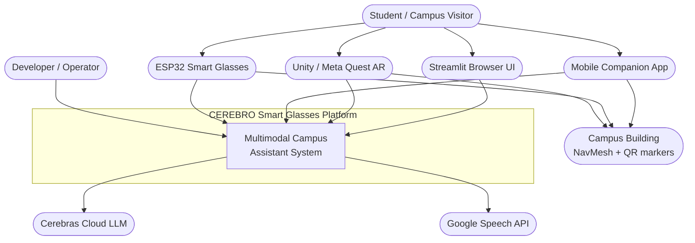
```mermaid
flowchart TB
    User([Student / Campus Visitor])
    Operator([Developer / Operator])

    subgraph CEREBRO["CEREBRO Smart Glasses Platform"]
        SYS[Multimodal Campus<br/>Assistant System]
    end

    Glasses([ESP32 Smart Glasses])
    Phone([Mobile Companion App])
    Quest([Unity / Meta Quest AR])
    Browser([Streamlit Browser UI])

    Cerebras([Cerebras Cloud LLM])
    GoogleSR([Google Speech API])
    Campus([Campus Building<br/>NavMesh + QR markers])

    User --> Glasses & Phone & Quest & Browser
    Operator --> SYS
    Glasses & Phone & Quest & Browser --> SYS
    SYS --> Cerebras
    SYS --> GoogleSR
    Quest --> Campus
    Glasses --> Campus
    Phone --> Campus
```

### 6.3 Thin-Client / Thick-Server Architecture

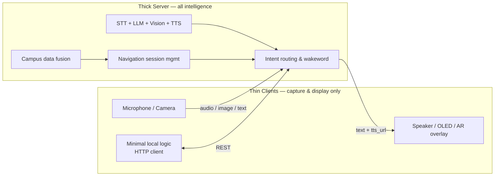
```mermaid
flowchart LR
    subgraph ThinClients["Thin Clients — capture & display only"]
        direction TB
        TC1[Microphone / Camera]
        TC2[Speaker / OLED / AR overlay]
        TC3[Minimal local logic<br/>HTTP client]
    end

    subgraph ThickServer["Thick Server — all intelligence"]
        direction TB
        TS1[Intent routing & wakeword]
        TS2[STT + LLM + Vision + TTS]
        TS3[Navigation session mgmt]
        TS4[Campus data fusion]
    end

    TC1 -->|audio / image / text| TS1
    TS2 --> TS1
    TS3 --> TS1
    TS4 --> TS3
    TS1 -->|text + tts_url| TC2
    TC3 <-->|REST| TS1
```

### 6.4 End-to-End Data Flow Overview

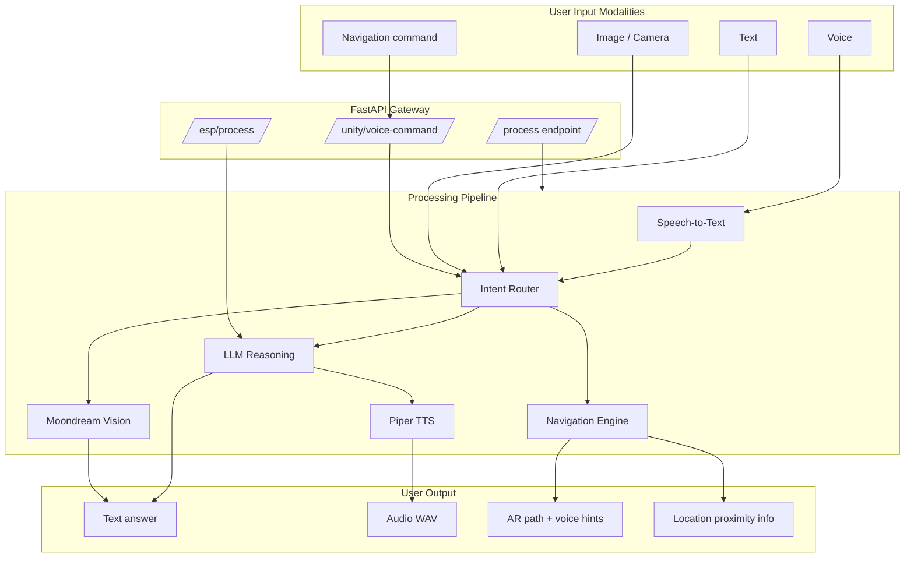
```mermaid
flowchart TD
    subgraph Input["User Input Modalities"]
        V[Voice]
        T[Text]
        I[Image / Camera]
        N[Navigation command]
    end

    subgraph Gateway["FastAPI Gateway"]
        P[/process endpoint/]
        UN[/unity/voice-command/]
        ESP[/esp/process/]
    end

    subgraph Processing["Processing Pipeline"]
        STT[Speech-to-Text]
        INT[Intent Router]
        LLM[LLM Reasoning]
        VIS[Moondream Vision]
        NAV[Navigation Engine]
        TTS_OUT[Piper TTS]
    end

    subgraph Output["User Output"]
        TXT[Text answer]
        AUD[Audio WAV]
        AR[AR path + voice hints]
        INFO[Location proximity info]
    end

    V --> STT --> INT
    T --> INT
    I --> INT
    N --> UN --> INT

    INT --> LLM & VIS & NAV
    LLM --> TXT & TTS_OUT
    VIS --> TXT
    NAV --> AR & INFO
    TTS_OUT --> AUD

    P --> Processing
    ESP --> LLM
```

---

## 7. Deployment & Process Topology

### 7.1 Physical Deployment Diagram

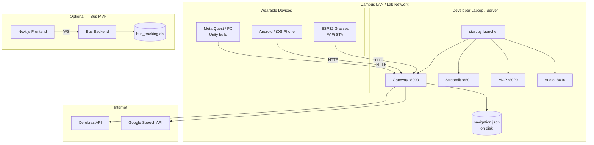
```mermaid
flowchart TB
    subgraph LAN["Campus LAN / Lab Network"]
        subgraph Host["Developer Laptop / Server"]
            SP[start.py launcher]
            GW[Gateway :8000]
            ST[Streamlit :8501]
            MCP[MCP :8020]
            AUD[Audio :8010]
            SP --> GW & ST & MCP & AUD
        end

        subgraph Wearables["Wearable Devices"]
            ESP[ESP32 Glasses<br/>WiFi STA]
            PH[Android / iOS Phone]
            Q[Meta Quest / PC<br/>Unity build]
        end

        NJF[(navigation.json<br/>on disk)]
        GW --> NJF
    end

    subgraph Cloud["Internet"]
        CB[Cerebras API]
        GSR[Google Speech API]
    end

    ESP & PH & Q -->|HTTP| GW
    GW --> CB
    GW --> GSR

    subgraph Optional["Optional — Bus MVP"]
        BB[Bus Backend]
        BF[Next.js Frontend]
        DB[(bus_tracking.db)]
        BB --> DB
        BF -->|WS| BB
    end
```

### 7.2 Runtime Process Topology (`start.py`)

```mermaid
flowchart LR
    START([python start.py<br/>profile: production-local])

    START --> P1[Uvicorn<br/>app.api.gateway:app<br/>:8000]
    START --> P2[Streamlit<br/>streamlit_app.py<br/>:8501]
    START --> P3[Audio Sidecar<br/>app.api.audio_sidecar:app<br/>:8011]
    START --> P4[MCP Server<br/>server.server:app<br/>:8020]

    P1 --> SVC[Assistant + Navigation<br/>+ QR + Audio services]
    P4 --> VIS[Vision tool endpoints]
```

### 7.3 Hardware Block Diagram

```mermaid
flowchart TB
    subgraph GlassesPCB["Custom Smart Glasses PCB — KiCAD"]
        ESP[ESP32-WROVER Module]
        PWR[TP4056 LiPo Charger]
        SW[Power Switch Latching]
        HDR[Expansion Headers]
    end

    subgraph Peripherals["Connected Peripherals"]
        MIC[INMP441 I2S Mic]
        OLED[SH1106 OLED 128x64]
        CAM[OV2640 Camera]
        SPK[Speaker / DAC]
        BAT[LiPo Battery]
    end

    subgraph Connectivity["Connectivity"]
        WIFI[WiFi STA → Gateway]
        BLE[BLE GATT Bridge]
    end

    BAT --> PWR --> ESP
    SW --> PWR
    ESP --> MIC & OLED & CAM & SPK
    ESP --> WIFI & BLE
    HDR --> ESP
```

---

## 8. Database — ER & Schema Diagrams

### 8.1 Campus Catalog — `navigation.json` (Logical ER)

The main gateway uses a **JSON document**, not SQL. This ER diagram shows the logical schema.

```mermaid
erDiagram
    BUILDING ||--o{ LOCATION : contains
    LOCATION ||--o{ STAFF_MEMBER : "has (Office)"
    LOCATION ||--o{ LECTURE : "has (LectureRoom)"

    BUILDING {
        string name
        string address
    }

    LOCATION {
        string id PK
        string name
        int floor
        float coord_x
        float coord_y
        string description
        string placeType
        float proximityRadius
    }

    STAFF_MEMBER {
        string name
        string deskLabel
        string role
        string email
        string officeHours
        json officeDays
        json coursesTaught
    }

    LECTURE {
        string courseName
        string courseCode
        string instructor
        string day
        string startTime
        string endTime
    }
```

### 8.2 Gateway In-Memory State Schema

```mermaid
erDiagram
    NAV_SESSION ||--|| STEP_PLAN : contains
    QR_MARKER ||--o{ QR_EVENT : generates
    TTS_TOKEN ||--|| WAV_CLIP : maps_to
    WAKE_CONTEXT ||--|| CLIENT_ID : per_client

    NAV_SESSION {
        uuid session_id PK
        string destination
        int step_index
        bool done
    }

    STEP_PLAN {
        int step_number
        string instruction_text
    }

    QR_MARKER {
        string qr_id PK
        string payload
        datetime last_seen
    }

    QR_EVENT {
        string qr_id FK
        string event_type
        json metadata
        datetime timestamp
    }

    TTS_TOKEN {
        string token PK
        bytes wav_data
        datetime expires_at
    }

    WAKE_CONTEXT {
        string client_id PK
        bool awaiting_followup
        datetime window_expires
    }
```

### 8.3 Expo Pathverse — SQLite `pathverse_ar.db`

```mermaid
erDiagram
    LOCATION_NODES ||--o{ EDGES : "node1"
    LOCATION_NODES ||--o{ EDGES : "node2"

    LOCATION_NODES {
        text id PK
        text name
        real x
        real y
        real z
        text type
    }

    EDGES {
        integer id PK
        text node1_id FK
        text node2_id FK
        real distance
    }
```

### 8.4 Bus MVP — SQLite `bus_tracking.db`

```mermaid
erDiagram
    STUDENTS ||--o{ WALLET_TRANSACTIONS : has
    INCIDENT_REPORTS

    STUDENTS {
        int id PK
        string name
        string home_location
        float home_lat
        float home_lng
        float wallet_balance
        string subscription_status
        datetime subscription_expires_at
        json usage_history
        datetime created_at
    }

    WALLET_TRANSACTIONS {
        int id PK
        int student_id FK
        string transaction_type
        float amount
        string status
        string description
        datetime created_at
    }

    INCIDENT_REPORTS {
        int id PK
        string reporter_role
        string reporter_name
        string incident_type
        text description
        int eta_impact_minutes
        bool is_active
        datetime created_at
        datetime resolved_at
    }
```

### 8.5 Complete Data Store Map

```mermaid
flowchart TB
    subgraph Persistent["Persistent Storage"]
        NJ[navigation.json<br/>Campus catalog]
        PV[(pathverse_ar.db<br/>Indoor nav graph)]
        BUS[(bus_tracking.db<br/>Students & incidents)]
        SET[local.settings.json<br/>Runtime config]
        GLB[LiDAR / GLB meshes<br/>Floorplan input]
    end

    subgraph Ephemeral["Ephemeral / In-Memory"]
        SESS[Navigation sessions dict]
        TTS_C[TTS WAV cache 180s TTL]
        QR_A[QR active markers]
        QR_T[QR telemetry log]
        WAKE[Wake context per client]
    end

    subgraph Consumers["Primary Consumers"]
        GW[FastAPI Gateway]
        UNITY[Unity AR Client]
        EXPO[Expo Mobile App]
        BB[Bus Backend]
    end

    NJ --> GW & UNITY
    SESS --> GW
    TTS_C --> GW
    QR_A & QR_T --> GW
    WAKE --> GW
    PV --> EXPO
    BUS --> BB
    SET --> GW
    GLB --> GW
```

---

## Suggested Chapter Placement

| Diagram | Recommended thesis section |
|---------|---------------------------|
| 1.1, 1.2 Use Case | Chapter 2 — Requirements Analysis |
| 2.1–2.4 Class | Chapter 3 — System Design |
| 3.1–3.2 Component | Chapter 3 — System Architecture |
| 4.1–4.4 Sequence | Chapter 4 — Implementation |
| 5.1–5.3 Activity/State | Chapter 3 or 4 — Behavior modeling |
| 6.1–6.4 Architecture | Chapter 3 — System Architecture |
| 7.1–7.3 Deployment | Chapter 3 — Deployment Design |
| 8.1–8.5 Database/ER | Chapter 3 — Data Design |

---

## Related Files

- [architecture_and_dataflow_diagrams.md](architecture_and_dataflow_diagrams.md) — original sequence + roadmap diagrams
- [full_project_documentation.md](full_project_documentation.md) — narrative text to accompany diagrams
- [08_chapter3_system_architecture.md](../16_submission_package/full_documentation/08_chapter3_system_architecture.md) — thesis chapter draft
- [navigation.json](../../navigation.json) — live campus data sample
- [bus_system/backend/app/db/models.py](../../bus_system/backend/app/db/models.py) — ORM source
